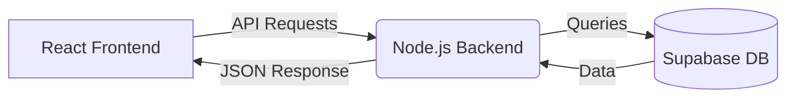

# BlogSpace

BlogSpace marks the beginning of my software development journey, serving as a foundational learning project to explore full-stack web development.

## What is BlogSpace?
BlogSpace is a simple, modern blogging platform where users can read, write, and manage blog posts. It demonstrates core web development concepts like routing, state management, and connecting a frontend to a backend service.

## Tech Stack
- **Frontend:** React, Vite, Tailwind CSS
- **Backend/Database:** Node.js, Supabase
- **Authentication:** JWT (JSON Web Tokens)

## How It Works
1. **Client Interface:** Users interact with a React-based frontend to view or create posts.
2. **API Communication:** The frontend sends requests to the backend server.
3. **Data Management:** The backend processes requests and interacts with Supabase to manage blog data securely.

## Architecture Flow



## Getting Started

To run this project locally:

1. Install dependencies:
   ```bash
   npm install
   ```

2. Start the development server (runs both frontend and backend concurrently):
   ```bash
   npm run dev
   ```
